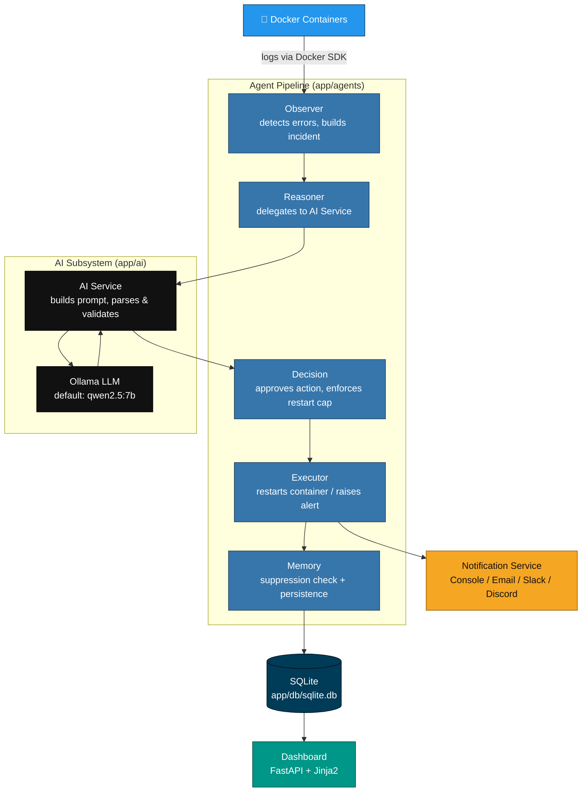

# ContainerDoctor AI

[](https://www.python.org/)
[](https://fastapi.tiangolo.com/)
[](https://www.docker.com/)
[](https://ollama.com/)
[](https://sqlite.org/)

**ContainerDoctor AI** is an autonomous Site Reliability Engineering (SRE) agent for Docker. It polls container logs on a fixed interval, detects failures via pattern matching, sends the incident to a locally-hosted LLM through [Ollama](https://ollama.com/) for diagnosis, decides on a recovery action, executes it, sends notifications, and persists the full incident to SQLite — all rendered through a FastAPI + Jinja2 dashboard.

```
observe  →  reason  →  decide  →  act  →  remember
```

---

## Table of Contents

- [Key Features](#key-features)
- [Architecture](#architecture)
- [Project Structure](#project-structure)
- [Technology Stack](#technology-stack)
- [Getting Started](#getting-started)
- [Configuration](#configuration)
- [Running the Service](#running-the-service)
- [Dashboard & Web Routes](#dashboard--web-routes)
- [REST API](#rest-api)
- [Agent Workflow](#agent-workflow)
- [Notifications](#notifications)
- [Safety & Recovery Limits](#safety--recovery-limits)

---

## Key Features

- **Continuous Docker monitoring** — polls each container in `TARGET_CONTAINERS` on a `CHECK_INTERVAL`, pulling the last `LOG_LINES` lines of logs via the Docker SDK.
- **Keyword-based failure detection** — scans logs for a fixed set of error patterns before anything is sent to the LLM.
- **AI-assisted root cause analysis** — builds a structured prompt, sends it to a local Ollama model, and parses/validates the JSON response before trusting it.
- **Autonomous decision engine** — turns a diagnosis into an approved action, capping automatic restarts per container.
- **Automatic remediation** — restarts unhealthy containers (or raises an alert) via the Docker SDK and records the outcome.
- **Multi-channel notifications** — console logging (always on), plus optional Email, Slack, and Discord.
- **Duplicate incident suppression** — a configurable time window prevents the same error signature from re-triggering the pipeline on every cycle.
- **Persistent incident history** — every cycle (logs, prompt, raw LLM response, decision, execution result, and a per-stage timeline) is stored in SQLite.
- **Analytics** — restart success rate, and per-container/severity/action breakdowns.
- **Local-first** — the only network calls are to your own Docker daemon, your local Ollama instance, and whichever notification webhooks you enable.

## Architecture



## Project Structure

```
app/
├── agents/            # Observe → Reason → Decide → Act → Remember pipeline
│   ├── observer.py       # Pulls logs per container, detects errors, builds an incident
│   ├── reasoner.py        # Delegates diagnosis to app.ai.ai_service
│   ├── decision.py        # Approves the AI's action, enforces the restart cap
│   ├── executor.py        # Executes the approved action, triggers notifications
│   └── memory.py          # Suppression check + incident persistence
├── ai/                  # LLM integration
│   ├── ollama_client.py    # HTTP client for Ollama's /api/generate and /api/tags
│   ├── prompts.py           # Diagnosis prompt template
│   ├── parser.py            # Extracts a JSON object from raw LLM output
│   ├── validator.py         # Validates/normalizes the diagnosis schema
│   └── ai_service.py        # Orchestrates prompt → call → parse → validate; health check
├── api/
│   ├── server.py           # FastAPI app factory; lifespan starts the background monitor
│   ├── routes.py            # JSON REST API (/health, /incidents, /analytics)
│   └── web_routes.py        # Server-rendered dashboard routes
├── services/
│   ├── docker_service.py       # Docker SDK integration: logs, restart, connection/status
│   ├── log_service.py          # Keyword-based error detection in raw log text
│   ├── monitor_service.py      # Runs and loops the agent pipeline, tracks per-cycle metrics
│   ├── database_service.py     # Raw sqlite3 schema, migrations, reads/writes for incidents
│   ├── analytics_service.py    # Aggregate incident statistics
│   └── notification_service.py # Console / Email / Slack / Discord delivery
├── templates/            # Jinja2 templates (dashboard, history, incident detail, analytics)
├── static/                # Dashboard CSS/JS
├── db/                    # SQLite database file (sqlite.db)
├── config.py              # Environment-driven configuration
└── main.py                # Runs a single monitoring cycle for local debugging
```

## Technology Stack

| Layer             | Technology                              |
|-------------------|-------------------------------------------|
| Backend           | FastAPI                                    |
| Language          | Python 3.11+                               |
| AI / LLM          | Ollama (default model: `qwen2.5:7b`)        |
| Container Runtime | Docker SDK for Python                       |
| Database          | SQLite, via the standard library `sqlite3` module |
| Frontend          | Jinja2 templates, HTML, CSS, JavaScript      |
| Notifications     | SMTP (`smtplib`), Slack webhooks, Discord webhooks |

## Getting Started

### Prerequisites

- Python 3.11+
- Docker Engine running locally, with the containers you want to monitor
- [Ollama](https://ollama.com/), with a model pulled

### Installation

```bash
git clone <repository-url>
cd container-doctor-ai
python -m venv venv
source venv/bin/activate       # On Windows: venv\Scripts\activate
pip install -r requirements.txt
```

### Install and start Ollama

```bash
curl -fsSL https://ollama.com/install.sh | sh
ollama pull qwen2.5:7b
```

## Configuration

ContainerDoctor AI is configured entirely through environment variables, loaded via `python-dotenv`. Create a `.env` file in the project root:

```env
# Container Monitoring
TARGET_CONTAINERS=web,redis,broken-app
CHECK_INTERVAL=10
LOG_LINES=50
INCIDENT_SUPPRESSION_SECONDS=300
AUTO_FIX=true
MAX_DIAGNOSES_PER_HOUR=20

# AI / Ollama
LLM_PROVIDER=ollama
OLLAMA_BASE_URL=http://127.0.0.1:11434
OLLAMA_MODEL=qwen2.5:7b
OLLAMA_TIMEOUT_SECONDS=60

# Notifications
EMAIL_ENABLED=false
SMTP_HOST=
SMTP_PORT=587
SMTP_USERNAME=
SMTP_PASSWORD=
EMAIL_FROM=
EMAIL_TO=

SLACK_ENABLED=false
SLACK_WEBHOOK_URL=

DISCORD_ENABLED=false
DISCORD_WEBHOOK_URL=

NOTIFICATION_TIMEOUT_SECONDS=10
```

| Variable | Description | Default |
|---|---|---|
| `TARGET_CONTAINERS` | Comma-separated container names to monitor | *(empty)* |
| `CHECK_INTERVAL` | Seconds between monitoring cycles | `10` |
| `LOG_LINES` | Trailing log lines fetched per container per cycle | `50` |
| `INCIDENT_SUPPRESSION_SECONDS` | Window during which a matching error signature is suppressed as a duplicate | `300` |
| `AUTO_FIX` | Read from the environment into config; not currently referenced elsewhere in the pipeline | `true` |
| `MAX_DIAGNOSES_PER_HOUR` | Read from the environment into config; not currently referenced elsewhere in the pipeline | `20` |
| `LLM_PROVIDER` | Read from the environment into config; `ai_service.py` currently always reports/uses the `ollama` provider | `ollama` |
| `OLLAMA_BASE_URL` | Base URL of the local Ollama server | `http://127.0.0.1:11434` |
| `OLLAMA_MODEL` | Ollama model used for diagnosis and health checks | `qwen2.5:7b` |
| `OLLAMA_TIMEOUT_SECONDS` | Request timeout for Ollama calls (health checks cap this at 1.5s) | `60` |
| `EMAIL_ENABLED` / `SLACK_ENABLED` / `DISCORD_ENABLED` | Enable each notification channel independently | `false` |
| `NOTIFICATION_TIMEOUT_SECONDS` | Timeout for SMTP connections and webhook POST requests | `10` |

> `AUTO_FIX`, `MAX_DIAGNOSES_PER_HOUR`, and `LLM_PROVIDER` are parsed into `config.py` but are not read anywhere else in the current codebase — they're listed here for completeness, not as documented behavior.

## Running the Service

Start the FastAPI application. Its lifespan handler initializes the database and starts the background monitoring loop (`monitor_forever`) as an asyncio task:

```bash
uvicorn app.api.server:app --reload
```

Dashboard: [http://127.0.0.1:8000](http://127.0.0.1:8000)

For a single, one-off monitoring cycle without the web server (used for local debugging):

```bash
python -m app.main
```

## Dashboard & Web Routes

| Route | Description |
|---|---|
| `GET /` | Main dashboard — Docker connection status, active containers, recent incidents (last 6), top 5 problematic containers, AI engine health, and the latest AI decision |
| `GET /dashboard/metrics` | Same dashboard data as JSON, with `Cache-Control: no-store` (used to refresh the dashboard) |
| `GET /history` | Full incident history list |
| `GET /history/{incident_id}` | Incident detail view, including a reconstructed per-agent status (Observer, Reasoner, Decision, Executor, Memory) and the stage timeline |
| `GET /analytics-dashboard` | Aggregate analytics view |

## REST API

| Method & Path | Description |
|---|---|
| `GET /health` | Docker connection status (`connected`/`unavailable`), monitored container names, total incident count |
| `GET /incidents` | Full list of stored incidents (errors, logs, prompt, raw LLM response, confidence, decision, execution result, timeline) |
| `GET /analytics` | Total incidents, restart success rate, most problematic container |

Interactive OpenAPI docs are available at `/docs` once the server is running.

## Agent Workflow

Each cycle (`run_monitoring_cycle`) does the following per detected incident:

1. **Observe** — for each container in `TARGET_CONTAINERS`, fetch the last `LOG_LINES` log lines and scan them for error keywords.
2. **Build incident** — package the container name, the last 10 log lines, detected error keywords, and a detection timestamp.
3. **Suppress duplicates** — if a matching error signature was already recorded for this container within `INCIDENT_SUPPRESSION_SECONDS`, skip the rest of the cycle for this incident.
4. **Reason** — send the incident to the local LLM via `ai_service.diagnose()`.
5. **Parse & validate** — extract a JSON object from the raw model output and validate it against the expected schema (`root_cause`, `severity`, `action`, `confidence`).
6. **Decide** — approve the action; a `restart` action is only approved if the container hasn't already been auto-restarted 3 times.
7. **Execute** — restart the container (or mark an alert) via the Docker SDK, and record the result.
8. **Notify** — send the outcome through the console, and any of Email/Slack/Discord that are enabled.
9. **Remember** — persist the full incident, diagnosis, decision, execution result, and timeline to SQLite.
10. **Visualize** — the dashboard and history views reflect the updated incidents on their next load.

Each stage's outcome is recorded as a timeline entry (e.g. "Incident detected", "LLM analysis complete" / "AI unavailable", "Decision made", "`<Action>` initiated", and a final outcome event), which is what powers the per-incident timeline in the dashboard.

## Notifications

Every completed recovery attempt is sent through `notification_service.send_notification()`. Delivery is **best-effort**: a failed webhook or SMTP call is caught and logged, never raised back into the recovery pipeline.

| Channel | Enable flag | Required settings | Delivery |
|---|---|---|---|
| Console | always on | — | A structured log line for every notification event |
| Email | `EMAIL_ENABLED` | `SMTP_HOST`, `EMAIL_FROM`, at least one address in `EMAIL_TO` | Multipart message (plain text + HTML) over SMTP; implicit TLS on port `465`, otherwise STARTTLS |
| Slack | `SLACK_ENABLED` | `SLACK_WEBHOOK_URL` | A single formatted `text` message via Slack's incoming webhook |
| Discord | `DISCORD_ENABLED` | `DISCORD_WEBHOOK_URL` | A rich embed via Discord's webhook API |

### Status indicator

Slack and Discord messages both open with a Slack-style emoji shortcode selected by severity/outcome:

| Condition | Shortcode |
|---|---|
| Recovery failed, or severity is `critical` | `:rotating_light:` |
| Severity is `high` | `:warning:` |
| Otherwise | `:white_check_mark:` |

### Slack message format

Sent as a single `text` field:

```
:emoji: *<title>*
*Container:* `<container>`
*Severity:* <SEVERITY>
*Root cause:* <root_cause>
*AI decision:* <Action> (<confidence>% confidence)
*Recovery:* <recovery result message>
*Time:* <UTC timestamp>
```

### Discord message format

Sent as a rich embed:

- **Title:** `:emoji: <title>`
- **Color:** `#45D796` (green) on success, `#FF7186` (red) on failure
- **Fields:** `Container`, `Severity`, and `AI decision` as inline fields; `Root cause` and `Recovery` as full-width fields
- **Footer:** the UTC timestamp

### Email format

Subject: `[<SEVERITY>] <title> — <container>`. Sent as a multipart message with both a plain-text body and an HTML alternative. Unlike Slack/Discord, the email body also includes the post-recovery **container status** and the **last 4,000 characters of logs** (HTML-escaped in the HTML alternative).

## Safety & Recovery Limits

- **Restart cap** — `decision.py` tracks restart counts per container in memory. Once a container has been auto-restarted 3 times, further `restart` diagnoses are downgraded to an `alert` action instead ("Restart limit exceeded").
- **Restart verification** — `docker_service.restart_container()` issues the restart with a 30-second stop timeout, waits 5 seconds, reloads the container, and only reports success if its status is `running`.
- **Duplicate suppression** — `has_recent_matching_incident()` compares the sorted, lowercased set of detected error keywords against the container's most recent incidents; a match within `INCIDENT_SUPPRESSION_SECONDS` is suppressed.
- **Error keyword filtering** — `log_service.detect_errors()` matches against a fixed list of failure keywords (`error`, `exception`, `traceback`, `failed`, `crash`, `fatal`, `panic`, `segmentation fault`, `out of memory`, `killed`, `oomkiller`, `connection refused`), while lines containing `query timeout`, `timeout policy`, or `configuration` are ignored.
- **Best-effort notifications** — notification failures are caught inside `executor._notify()` and never affect the recorded recovery result.
- **Graceful AI degradation** — if Ollama is unreachable, times out, or returns output that fails parsing/validation, `ai_service.diagnose()` returns a fallback diagnosis (`root_cause: "AI unavailable"`, `severity: "critical"`, `action: "alert"`, `confidence: 0.0`) instead of raising.
- **Cycle-level fault isolation** — an unhandled exception while processing one incident, or during the observer step, is logged and the monitoring loop continues rather than crashing.
